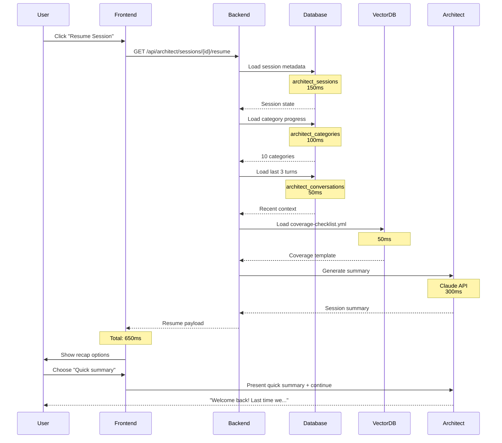

# Session Resume Flow Design

## Overview

This document defines how Quetrex's voice architect resumes multi-session conversations. The goal is to provide seamless continuity across sessions without re-asking questions, while giving users control over how much context they want to review.

## Design Principles

1. **Never Re-Ask Answered Questions** - The architect maintains perfect memory of what was discussed
2. **User Choice** - Users control how much recap they want (detailed, quick, or none)
3. **Context Window Management** - Intelligent budgeting to fit system prompt, session state, and conversation history
4. **Fast Resume** - Session state loads in <500ms for good UX
5. **Smart Continuation** - Pick up exactly where the last session left off

## Resume Flow

### High-Level Flow

```
User returns to paused session
    ↓
Load session state from database
    ↓
Load coverage-checklist.yml
    ↓
Load last 3 conversation turns
    ↓
Generate session summary
    ↓
Present recap options to user
    ↓
User chooses recap preference
    ↓
Provide appropriate recap
    ↓
Continue conversation from last topic
```

### Detailed Flow with Timing



## Data Loading Strategy

### Step 1: Load Session Metadata (150ms)

Query the `architect_sessions` table:

```sql
SELECT *
FROM architect_sessions
WHERE id = :sessionId
AND project_id IN (
  SELECT id FROM projects WHERE user_id = :userId
);
```

**Loaded Data:**
- Session status, completion %, readiness score
- Last topic discussed
- Total conversation turns
- Last active timestamp

### Step 2: Load Category Progress (100ms)

Query the `architect_categories` table:

```sql
SELECT *
FROM architect_categories
WHERE session_id = :sessionId
ORDER BY last_discussed_at DESC NULLS LAST;
```

**Loaded Data:**
- All 10 coverage categories
- Completion % and confidence scores
- Missing items per category
- Key points captured
- Last question asked in each category

### Step 3: Load Recent Conversation Context (50ms)

Query the `architect_conversations` table for last 3 turns:

```sql
SELECT *
FROM architect_conversations
WHERE session_id = :sessionId
ORDER BY turn_number DESC
LIMIT 3;
```

**Loaded Data:**
- Last 3 conversation turns (user + assistant messages)
- Provides immediate context for what was being discussed
- Enables natural conversation continuation

**Why Last 3 Turns?**
- Typically covers the last question-answer exchange
- Fits in ~1500 tokens (500 tokens per turn average)
- Enough context to continue naturally
- Full history available in database if needed

### Step 4: Load Coverage Checklist Template (50ms)

Load the `coverage-checklist.yml` template from vector DB or filesystem:

```yaml
coverage:
  business_requirements:
    required_questions: [...]
    subtopics: [...]
  database_architecture:
    required_questions: [...]
    subtopics: [...]
  # ... 8 more categories
```

**Purpose:**
- Understand what questions still need to be asked
- Calculate what's missing in each category
- Guide next steps in conversation

### Step 5: Generate Session Summary (300ms)

Use Claude API to generate a concise summary:

**Prompt Template:**

```
You are resuming an architect session. Generate a brief summary.

SESSION STATE:
- Overall completion: {overallCompletion}%
- Readiness score: {readinessScore}%
- Last topic: {lastTopic}
- Total turns: {totalTurns}

CATEGORY PROGRESS:
{categories.map(c => `- ${c.category}: ${c.completion}% (${c.status})`)}

LAST 3 TURNS:
{recentConversations}

MISSING ITEMS (TOP 3 CATEGORIES):
{topMissingCategories}

Generate:
1. One-sentence summary of what was accomplished
2. One-sentence summary of what's next
3. Detailed recap (2-3 sentences covering key decisions)

Output as JSON:
{
  "quick": "...",
  "next": "...",
  "detailed": "..."
}
```

**Token Budget:** 2000 tokens max (input + output)

**Example Output:**

```json
{
  "quick": "Last session covered business requirements and database architecture for a bookmark manager SaaS app.",
  "next": "Next, we need to discuss API design, security model, and UI/UX screens.",
  "detailed": "We defined a bookmark manager for individual knowledge workers handling 100-1000 bookmarks. The database uses PostgreSQL with User and Bookmark models, including tags and full-text search. Authentication uses JWT with bcrypt password hashing. We still need to design the REST API endpoints, specify the security model, and create UI screen mockups."
}
```

## Context Window Budget

Total budget: **10,000 tokens**

**Breakdown:**

1. **System Prompt**: 2,000 tokens
   - Architect role and instructions
   - Coverage checklist template
   - TDD and TypeScript guidelines

2. **Session State**: 4,000 tokens
   - Session metadata (100 tokens)
   - Category progress (10 × 150 = 1,500 tokens)
   - Coverage checklist (1,500 tokens)
   - Decisions log (10 × 100 = 1,000 tokens)

3. **Conversation Context**: 3,000 tokens
   - Last 3 turns (3 × 500 = 1,500 tokens)
   - Session summary (500 tokens)
   - User's chosen recap (500 tokens)
   - Buffer (500 tokens)

4. **User Input**: 1,000 tokens
   - Current user message

**Why This Budget?**
- Fits comfortably in GPT-4's 128K context window
- Leaves 118K tokens for full conversation history if needed
- Optimizes for speed (less context = faster API calls)
- Can be expanded dynamically if user asks "What did we discuss about X?"

## User Recap Options

### Option 1: Detailed Recap

**User Choice:** "Give me a detailed recap"

**Response Pattern:**

```
Welcome back to your [PROJECT_NAME] architect session!

Here's what we've accomplished so far:

[DETAILED SUMMARY FROM CLAUDE]

Your specification is currently {overallCompletion}% complete with a {readinessScore}% readiness score.

Completed areas: [LIST OF 90%+ categories]
In progress: [LIST OF 70-89% categories]
Not started: [LIST OF <70% categories]

Key decisions made:
- [Decision 1]
- [Decision 2]
- [Decision 3]

Ready to continue? I suggest we focus on [NEXT_TOPIC] next.
```

**Use Case:** User returning after several days/weeks, needs full context refresh

### Option 2: Quick Summary

**User Choice:** "Give me a quick summary"

**Response Pattern:**

```
Welcome back!

[QUICK SUMMARY FROM CLAUDE]

We're {overallCompletion}% complete. Next up: [NEXT_TOPIC].

Ready to continue?
```

**Use Case:** User returning same day or next day, remembers general context

### Option 3: Dive Right In

**User Choice:** "Skip the recap, let's continue"

**Response Pattern:**

```
Great! Picking up where we left off...

[LAST_QUESTION or NEXT_QUESTION based on last turn]
```

**Use Case:** User stepping away briefly (bathroom break, phone call), has full context in mind

## Resume Decision Logic

### Determining Next Action

After recap, the architect decides what to do next using this logic:

```python
if last_turn.role == 'assistant' and last_turn.content.endswith('?'):
    # We asked a question that wasn't answered
    action = "repeat_last_question"

elif last_turn.role == 'user':
    # We received an answer but session ended before our response
    action = "respond_to_last_answer"

elif current_category.completion < 90:
    # Current category not complete
    action = "continue_current_category"

elif all_categories.filter(c => c.completion < 90).length > 0:
    # Move to next incomplete category
    next_category = categories.find(c => c.completion < 90)
    action = "start_next_category"

else:
    # All categories complete!
    action = "generate_specification"
```

### Examples

**Scenario 1: Unanswered Question**

```
Last turn: "How many users do you expect in the first year?" (assistant)

Resume behavior:
→ "Welcome back! I asked: How many users do you expect in the first year?"
```

**Scenario 2: Unprocessed Answer**

```
Last turn: "Probably around 50-100 users" (user)

Resume behavior:
→ "Great! 50-100 users is a good target for an MVP. That influences our scaling decisions..."
  [Continues processing the answer and asks next question]
```

**Scenario 3: Mid-Category**

```
Last category: business_requirements (75% complete)
Last turn: Completed answer about target users

Resume behavior:
→ "Perfect. Now let's talk about your core features. What are the must-have features for v1?"
```

**Scenario 4: Between Categories**

```
Last category: business_requirements (100% complete)
Next category: database_architecture (0% complete)

Resume behavior:
→ "Excellent! We've fully defined your business requirements. Now let's design your database architecture. What data will your application manage?"
```

## Database Queries

### Complete Resume Query (TypeScript + Drizzle)

```typescript
import { db } from '@/db';
import {
  architectSessions,
  architectCategories,
  architectConversations,
  architectDecisions
} from '@/db/schema';
import { eq, desc } from 'drizzle-orm';

async function loadSessionForResume(sessionId: string, userId: string) {
  // 1. Load session with project (validates user ownership)
  const session = await db.query.architectSessions.findFirst({
    where: eq(architectSessions.id, sessionId),
    with: {
      project: {
        where: eq(projects.userId, userId)
      }
    }
  });

  if (!session || !session.project) {
    throw new Error('Session not found or access denied');
  }

  // 2. Load all categories
  const categories = await db.query.architectCategories.findMany({
    where: eq(architectCategories.sessionId, sessionId),
    orderBy: [desc(architectCategories.lastDiscussedAt)]
  });

  // 3. Load last 3 conversation turns
  const recentConversations = await db.query.architectConversations.findMany({
    where: eq(architectConversations.sessionId, sessionId),
    orderBy: [desc(architectConversations.turnNumber)],
    limit: 3
  });

  // 4. Load all decisions
  const decisions = await db.query.architectDecisions.findMany({
    where: eq(architectDecisions.sessionId, sessionId),
    orderBy: [desc(architectDecisions.createdAt)]
  });

  return {
    session,
    categories,
    recentConversations: recentConversations.reverse(), // Oldest to newest
    decisions
  };
}
```

## Error Handling

### Session Not Found

```typescript
if (!session) {
  return {
    error: 'SESSION_NOT_FOUND',
    message: 'This session does not exist or you do not have access to it.'
  };
}
```

### Session Completed

```typescript
if (session.status === 'complete') {
  return {
    info: 'SESSION_COMPLETE',
    message: 'This session is already complete. View the generated specification or start a new session.',
    specPath: session.specificationPath
  };
}
```

### Session Abandoned

```typescript
const daysSinceActive = Math.floor(
  (Date.now() - session.lastActiveAt.getTime()) / (1000 * 60 * 60 * 24)
);

if (session.status === 'abandoned' || daysSinceActive > 30) {
  return {
    warning: 'SESSION_OLD',
    message: `This session has been inactive for ${daysSinceActive} days. You can still resume it, but starting fresh might be better.`,
    options: ['resume', 'start_new']
  };
}
```

## Performance Optimization

### Caching Strategy

**Session State Cache (Redis):**
```typescript
const cacheKey = `architect:session:${sessionId}:state`;
const cachedState = await redis.get(cacheKey);

if (cachedState) {
  return JSON.parse(cachedState);
}

const state = await loadSessionForResume(sessionId, userId);
await redis.set(cacheKey, JSON.stringify(state), { ex: 300 }); // 5min TTL
return state;
```

**Cache Invalidation:**
- Invalidate on any conversation turn
- Invalidate on category update
- Invalidate on decision recorded

### Database Optimization

**Indexes (already defined in schema):**
- `architect_sessions.project_id` - Fast session lookup by project
- `architect_categories.session_id` - Fast category loading
- `architect_conversations.session_id + turn_number` - Fast recent turn queries

**Query Optimization:**
- Use `LIMIT 3` on conversations (don't load entire history)
- Use Drizzle's `with` to join project in single query
- Cache coverage-checklist.yml template in memory

## Frontend Implementation

### Resume Button UI

```typescript
// SessionCard.tsx
function SessionCard({ session }: { session: ArchitectSession }) {
  const resumeSession = async () => {
    const response = await fetch(`/api/architect/sessions/${session.id}/resume`);
    const data = await response.json();

    // Show recap options modal
    setResumeData(data);
    setShowRecapModal(true);
  };

  return (
    <Card>
      <h3>{session.sessionName || session.project.name}</h3>
      <Progress value={session.overallCompletion} />
      <p>Last active: {formatDistanceToNow(session.lastActiveAt)}</p>
      <Button onClick={resumeSession}>Resume Session</Button>
    </Card>
  );
}
```

### Recap Options Modal

```typescript
// RecapModal.tsx
function RecapModal({ data, onContinue }: RecapModalProps) {
  return (
    <Modal>
      <h2>Resume Session</h2>
      <p>How much context do you want?</p>

      <Button onClick={() => onContinue('detailed')}>
        Detailed Recap
        <small>Full summary of everything discussed</small>
      </Button>

      <Button onClick={() => onContinue('quick')}>
        Quick Summary
        <small>Brief overview and next steps</small>
      </Button>

      <Button onClick={() => onContinue('none')}>
        Dive Right In
        <small>Skip recap, continue where we left off</small>
      </Button>
    </Modal>
  );
}
```

## Testing Strategy

### Unit Tests

```typescript
describe('Session Resume', () => {
  it('should load session state in <500ms', async () => {
    const start = Date.now();
    const state = await loadSessionForResume(sessionId, userId);
    const duration = Date.now() - start;

    expect(duration).toBeLessThan(500);
    expect(state.session).toBeDefined();
    expect(state.categories).toHaveLength(10);
  });

  it('should only load last 3 conversation turns', async () => {
    const state = await loadSessionForResume(sessionId, userId);
    expect(state.recentConversations).toHaveLength(3);
  });

  it('should deny access to other users sessions', async () => {
    await expect(
      loadSessionForResume(sessionId, differentUserId)
    ).rejects.toThrow('Session not found or access denied');
  });
});
```

### E2E Tests

```typescript
test('Resume session flow', async ({ page }) => {
  // Create a paused session
  await createSession({ status: 'paused', completion: 45 });

  // Navigate to dashboard
  await page.goto('/dashboard');

  // Click resume
  await page.click('[data-testid="resume-session"]');

  // Should show recap options
  await expect(page.locator('text=How much context')).toBeVisible();

  // Choose quick summary
  await page.click('text=Quick Summary');

  // Should load voice interface with summary
  await expect(page.locator('[data-testid="voice-chat"]')).toBeVisible();

  // Summary should mention completion percentage
  await expect(page.locator('text=/45%/')).toBeVisible();
});
```

## Future Enhancements

### Phase 2: Smart Context Expansion

If user asks "What did we decide about authentication?":
1. Search `architect_decisions` by keyword
2. Search `architect_conversations` for relevant turns
3. Dynamically expand context window for that topic
4. Return to normal context after topic is addressed

### Phase 3: Visual Session Timeline

```
[========================================] 100%
    ^           ^                    ^
    Day 1       Day 3                Day 7
    (30%)       (60%)                (100%)
```

Click any point to see what was discussed that day.

### Phase 4: Session Branching

"Let's explore an alternative architecture approach"
→ Fork session to explore different technical choices
→ Compare branches side-by-side
→ Merge preferred decisions back to main session

---

**Status**: Ready for implementation
**Last Updated**: 2025-11-22
**Author**: Glen Barnhardt with help from Claude Code
